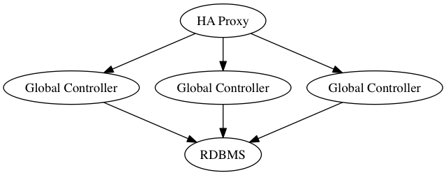
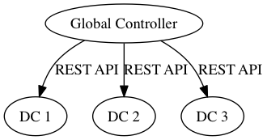

# Architecture

Basically, OpenContrail Global Controller takes simple web 3-tire application for simple operation.
It stores resource configurations in the RDBMS such as MySQL so that we can ensure consistency on
resource configuration. Each OpenContrail Global Controller has build-in queue so that it can process
 large number of processes.

OpenContrail Global Controller supports OpenStack Keystone as user identity management system, so you can
integrate OpenContrail Global Controller with multiple OpenStack deployment.
OpenContrail Global Controller consumes OpenStack API including Nova, Neutron Heat on each region, and it also
consumes OpenContrail VNC API in case of required capabilities are not supported in the OpenStack API side.

Each local OpenContrail Controllers exchange routes with identifiers configured from OpenContrail Global Controller.

## High Availability

OpenContrail Global controller is using simple web 3-tier architecture, so we can
archive active-active setup under load balancers. For backend RDBMS, we can use
Galera or MySQL master-slave replication.